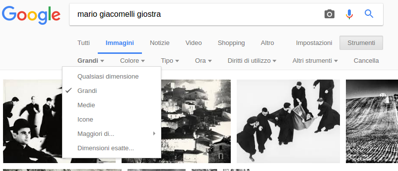
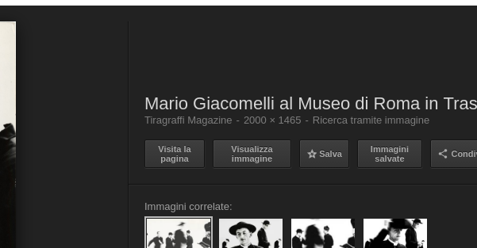

Da qualche anno frequento un gruppo di fotografi a San Giuliano il paese dove abito; il "Laboratorio di Fotografia e Cultura" è composto da fotografi amatoriali tutti di ottimo livello con formazione e cultura (informatica) diversa.

Parte fondamentale della attività del gruppo è la presentazione del lavoro di grandi autori del passato o contemporanei; per farlo in modo efficace spesso e volentieri è necessario approvigionarsi di fotografie disponibili su internet.

Sorvoliamo sugli aventuali problemi di lesione di copiright che secondo me in questo contesto non si pongono (la visione avviene nello spazio usato dal gruppo che prevede una quota associativa, quindi di tratta di uno spazio a tutti gli effetti privato inoltre la presentazione degli autori non viene pagata in sè quindi non c'è lucro sulle specifiche immagini); il problema fondamentale è trovare le immagini un una **dimensione adeguata** alla proiezione.

Ho l'impressione che spesso chi con grande dedizione e passione prepara le presentazioni spesso ricerchi le immagini nel sito ufficiale dell'autore che vuole presentare e in molti casi si tratta di vere e proprie miniature (probabilmente perchè così l'autore o il suo editore spera di vendere qualche copia di libro in più, salvo magari nemmeno mettere un link verso un qualsiasi servizio di vendita libri online ... tanto meglio: sostenete i librai della vostra zona, sono pochi e fanno una fatica bestia a sopravvivere).

Torniamo alle dimensioni delle immagini, per cercare l'immagine più grande possibile puoi usare la funzione di ricerca immagini di Google, qui cercando bene puoi trovare uno strumento che permette di ricercare l'immagine nella dimensione voluta.

Inizia con ricercare l'immagine che desideri per esempio indicando nel box di ricerca il nome dell'autore e il soggetto dell'immagine, nella pagina dei risultati sotto al box potrai scegliere il link alla ricerca per immagini.

A questo punto se scarichi l'immagine con il click destro del mouse otterrai una inutile miniatura della foto che desideravi. Ancora un piccolo sforzo, seleziona il bottone "Strumenti" che trovi sulla destra e a questo punto potrai impostare un filtro per visualizzare le sole immagini "Grandi"

Ci siamo quasi, non fermarti qui anche questa sono inutili miniature, clikka sulla immagine che desideri e poi sul bottone "Visualizza immagine"

Solo a questo punto avrai nel tuo browser l'immagine a dimensione completa, un click destro, "Salva come..." e puoi completare degnamente la tua presentazione.

Se l'ho fatta troppo lunga o ho fatto confusione forse questo video ti può aiutare .